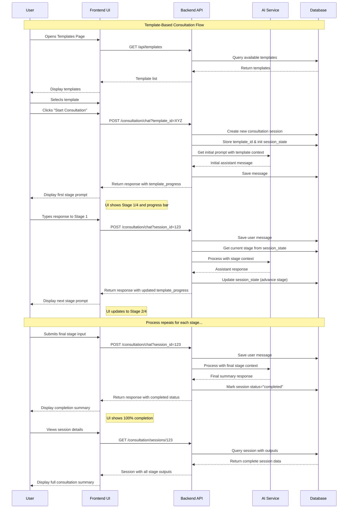

```mermaid
sequenceDiagram
    participant U as User
    participant UI as Frontend UI
    participant BE as Backend API
    participant AI as AI Service
    participant DB as Database

    Note over U,DB: Template-Based Consultation Flow

    %% Template Selection
    U->>UI: Opens Templates Page
    UI->>BE: GET /api/templates
    BE->>DB: Query available templates
    DB-->>BE: Return templates
    BE-->>UI: Template list
    UI-->>U: Display templates
    U->>UI: Selects template
    
    %% Start Consultation
    U->>UI: Clicks "Start Consultation"
    UI->>BE: POST /consultation/chat?template_id=XYZ
    BE->>DB: Create new consultation session
    BE->>DB: Store template_id & init session_state
    BE->>AI: Get initial prompt with template context
    AI-->>BE: Initial assistant message
    BE->>DB: Save message
    BE-->>UI: Return response with template_progress
    UI-->>U: Display first stage prompt
    Note right of UI: UI shows Stage 1/4 and progress bar

    %% Stage 1 Interaction
    U->>UI: Types response to Stage 1
    UI->>BE: POST /consultation/chat?session_id=123
    BE->>DB: Save user message
    BE->>DB: Get current stage from session_state
    BE->>AI: Process with stage context
    AI-->>BE: Assistant response
    BE->>DB: Update session_state (advance stage)
    BE-->>UI: Return response with updated template_progress
    UI-->>U: Display next stage prompt
    Note right of UI: UI updates to Stage 2/4

    %% Repeat for Remaining Stages
    Note over U,DB: Process repeats for each stage...

    %% Final Stage Completion
    U->>UI: Submits final stage input
    UI->>BE: POST /consultation/chat?session_id=123
    BE->>DB: Save user message
    BE->>AI: Process with final stage context
    AI-->>BE: Final summary response
    BE->>DB: Mark session status="completed"
    BE-->>UI: Return response with completed status
    UI-->>U: Display completion summary
    Note right of UI: UI shows 100% completion

    %% View Session Details
    U->>UI: Views session details
    UI->>BE: GET /consultation/sessions/123
    BE->>DB: Query session with outputs
    DB-->>BE: Return complete session data
    BE-->>UI: Session with all stage outputs
    UI-->>U: Display full consultation summary
```